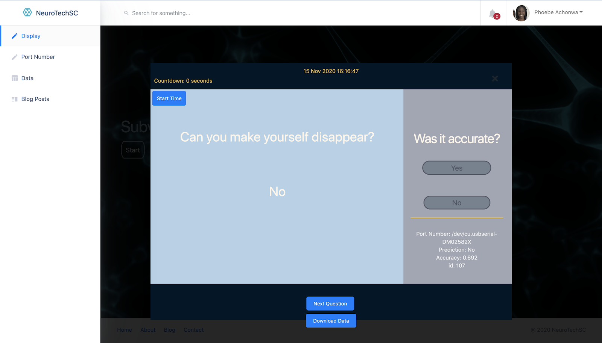

# Neurotechx
<!-- TABLE OF CONTENTS -->
## Table of Contents

* [About the Project](#about-the-project)
  * [Technologies](#technologies)
  * [Prerequisites](#prerequisites)
  * [Installation](#installation)
* [Usage](#usage)
* [License](#license)
* [Contact](#contact)
* [Sources](#acknowledgements)


<!-- ABOUT THE PROJECT -->
## About The Project


<!-- TECHNOLOGIES -->
### Technologies
* React
* Flask
* PyTorch, Scikit, Numpy, MNE 
* OpenBCI and Brainflow

<!-- INSTALLATION -->
### Installation
For MacOs:
```
cd api
python3 -m venv venv
source venv/bin/activate
pip install -r requirements.txt
cd ..
python api/api.py runserver -d -r
```
In Second Terminal:
```
npm install
npm start
```

<!-- USAGE EXAMPLES -->
## Usage
* Input portnumber for hardware
* Press Start time on UI
* Prediction for your response to the question is displayed
* Record accuracy with left hand side (response recorded into database)
* Next Question 


<!-- CONTACT -->
## Contact
<a href="https://neurotech.ucsc.edu/">NeuroTechSC</a>

### Built using

- [Shards React](https://github.com/designrevision/shards-react)
- [Chart.js](https://www.chartjs.org/)
- [Flux](https://facebook.github.io/flux/)
- [No UI Slider](https://refreshless.com/nouislider/)
- [React Datepicker](https://www.npmjs.com/package/react-datepicker)
- [Quill](https://quilljs.com/)
- [AlterEgo](https://www.media.mit.edu/publications/alterego-IUI/)

<br />

### Changelog

Please check out the [CHANGELOG](CHANGELOG.md).
